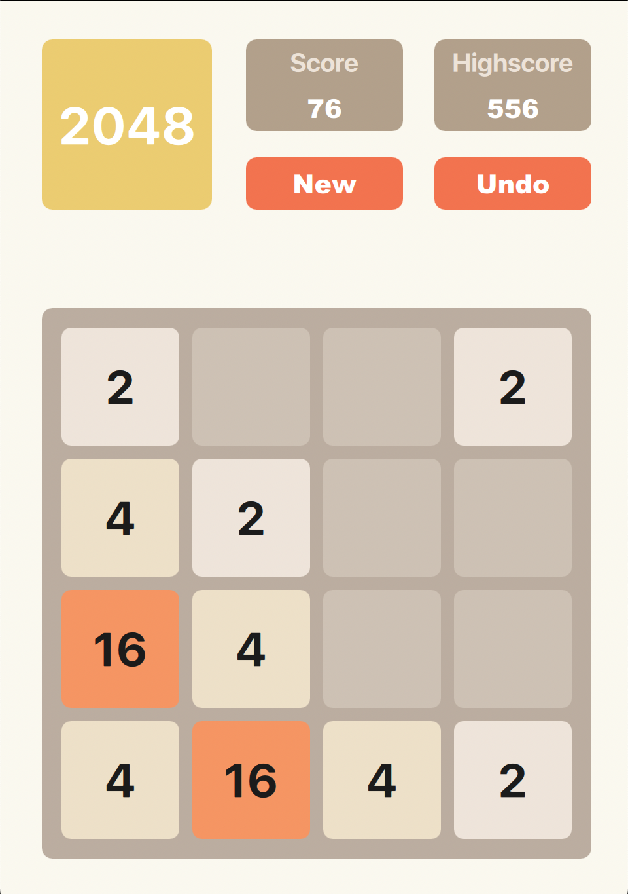

# 2048 Game in C++

This is a implementation of the popular 2048 game, written in C++, using Qt Creator for creating the user interface. Players can use arrow keys to move the tiles on a 4x4 grid. When two tiles with the same number touch, they merge into one, doubling their value. The objective of the game is to create a tile with the value of 2048.



## Table of Contents

- [2048 Game in C++](#2048-game-in-c)
  - [Table of Contents](#table-of-contents)
  - [Requirements](#requirements)
  - [Installation](#installation)
  - [How to Play](#how-to-play)
  - [License](#license)

## Requirements

To compile and run this game, you need:

- A C++ compiler supporting the C++11 standard (e.g., GCC, Clang, or Visual Studio)
- CMake (version 3.10 or higher)

## Installation

1. Clone this repository to your local machine:

```shell
git clone https://github.com/your_username/2048-cpp.git
```

2. Navigate to the project directory:

```shell
cd 2048-cpp
```

3. Create a build directory and navigate to it:

```shell
mkdir build && cd build
```

4. Run CMake to generate the build files:

```shell
cmake ..
```

5. Compile the game:

- On Linux and macOS:

```shell
make
```

- On Windows (using Visual Studio):

```shell
cmake --build .
```

1. Run the game:

- On Linux and macOS:

```shell
./2048_game
```

- On Windows:

```shell
.\2048_game.exe
```

## How to Play

- Use the arrow keys to move the tiles: up, down, left, or right.
- When two tiles with the same number touch, they merge into one, doubling their value.
- The game is won when a tile with the value of 2048 is created.
- The game is lost when there are no valid moves left and the board is full.

## License

This project is licensed under the MIT License.
